# EventMS

EventMS is a Laravel-based event management platform for organizers who need to create events, publish shareable event pages, manage ticket types, and track attendee registrations from a simple dashboard.

## What the app can do

- Create and update events with date, time, venue, description, and cover image
- Publish events to a public event URL
- Manage multiple ticket tiers for an event
- Support both free registrations and ticket-based registrations
- Track ticket inventory with sold counts
- View attendee lists and check-in status from the organizer workspace
- Give super admins a platform overview with user, event, attendee, and revenue metrics
- Manage super admin and organizer accounts from a dedicated admin users screen
- Review all platform events from a centralized admin events workspace
- Review attendee registrations and revenue from a centralized admin attendees workspace
- Surface recent platform activity from the admin notification dropdown
- Mark notifications as read directly from the dropdown, or automatically when opening them
- Seed both a super admin account and an organizer account for local testing

## Current status

The core organizer and registration flows are working and covered by feature tests.

Known limitations:

- The project still runs on Laravel 8, so PHP 8.4 shows deprecation warnings during local development and tests
- Ticket pricing is supported, but there is no payment gateway integration yet
- A full framework upgrade would still be a good next step if you want a quieter and more future-proof setup

## Tech stack

- Laravel 8
- Blade templates
- Tailwind CSS
- jQuery for some dashboard interactions
- SQLite or MySQL for persistence

## Quick start

1. Clone the repository

```bash
git clone https://github.com/Osalumense/event-ms.git
cd event-ms
```

2. Install dependencies

```bash
composer install
npm install
```

3. Create your environment file

```bash
cp .env.example .env
php artisan key:generate
```

4. Configure your database

For a quick local SQLite setup:

```bash
touch database/database.sqlite
```

Then update `.env`:

```env
DB_CONNECTION=sqlite
DB_DATABASE=/absolute/path/to/event-ms/database/database.sqlite
```

You can also use MySQL if you prefer.

5. Run the migrations and seed demo users

```bash
php artisan migrate:fresh --seed --seeder=CreateAdminSeeder
```

6. Start the app

```bash
php artisan serve
```

The app will be available at `http://127.0.0.1:8000`.

## Seeded login accounts

Organizer account:

- Email: `user@ems.com`
- Password: `password`

Super admin account:

- Email: `admin@ems.com`
- Password: `password`

## Testing

Core feature coverage now exists for both organizer and admin flows.

Organizer coverage:

- organizer event creation and publishing
- free event registration
- ticket-required validation for ticketed events
- ticketed registration with inventory updates

Admin coverage:

- super admin login redirect
- admin overview metrics
- user create, update, and delete flow
- admin event and attendee review pages

Run the feature suites with:

```bash
php artisan test tests/Feature/EventManagementFlowTest.php
php artisan test tests/Feature/AdminManagementFlowTest.php
```

Note: on PHP 8.4, Laravel 8 dependencies still emit deprecation warnings even though the tests pass.

## Screenshots

### Homepage

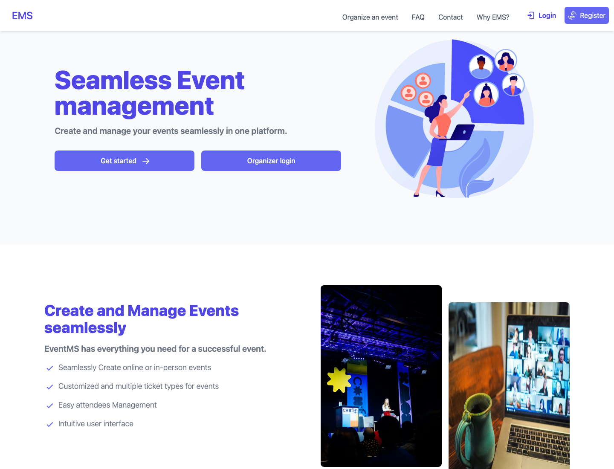

### Organizer dashboard

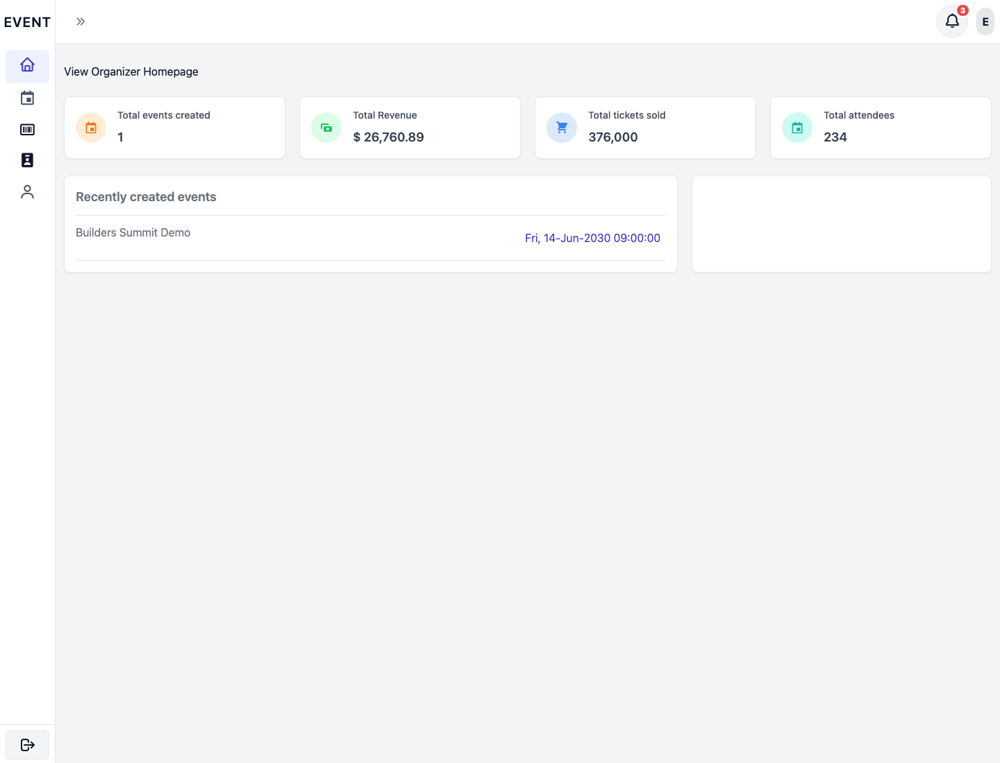

### Create event

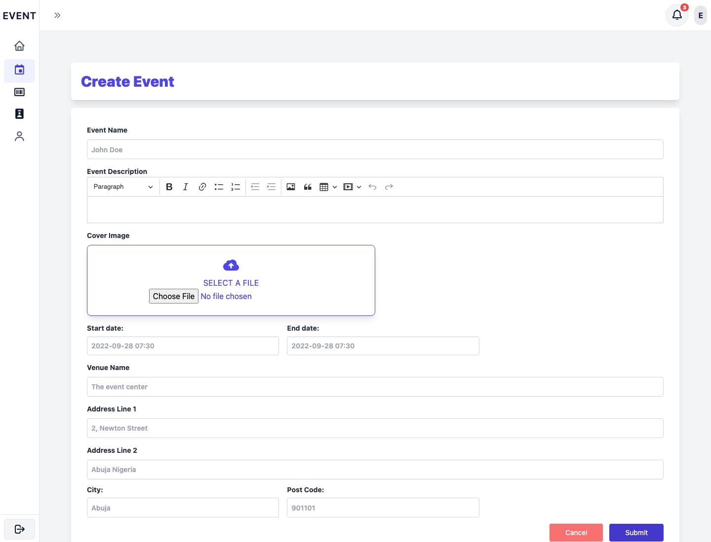

### Event workspace

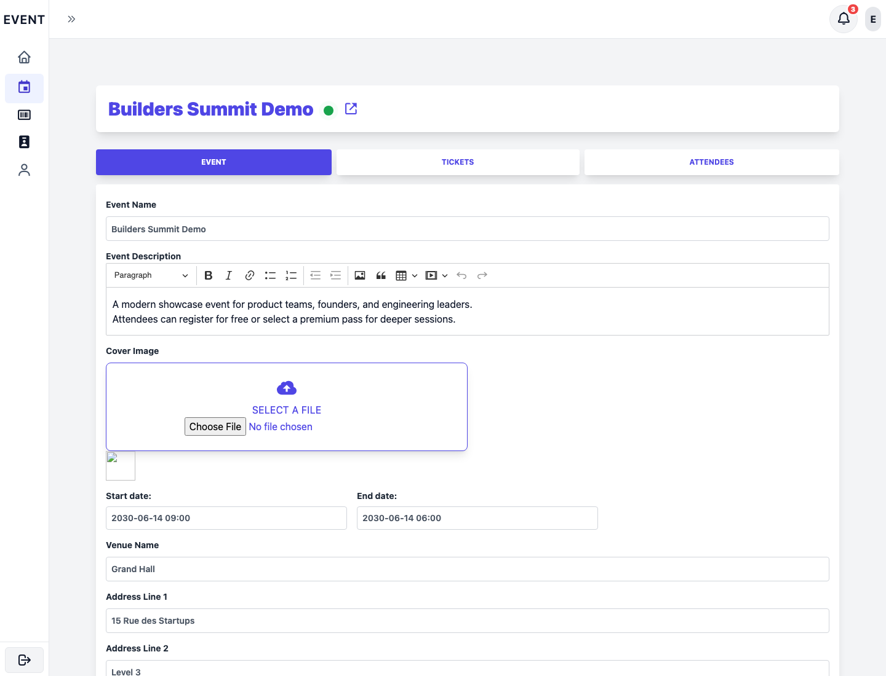

### Public event page

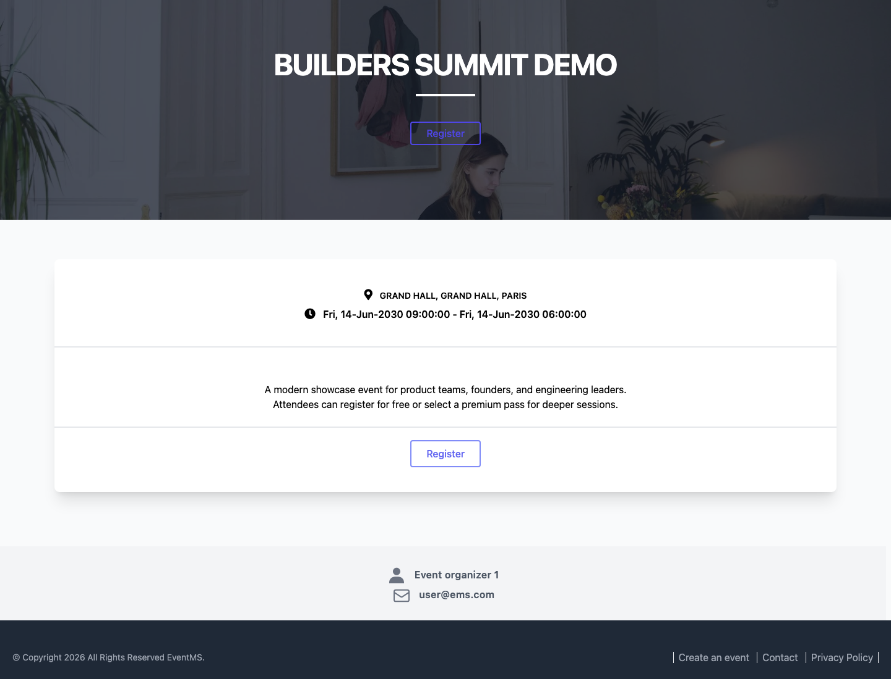

### Registration page

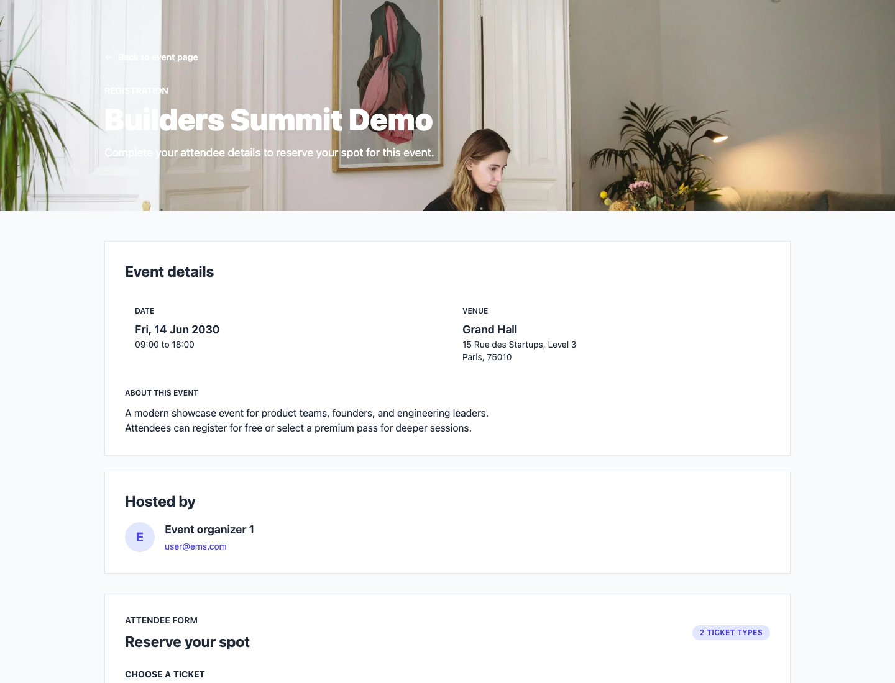

### Admin overview

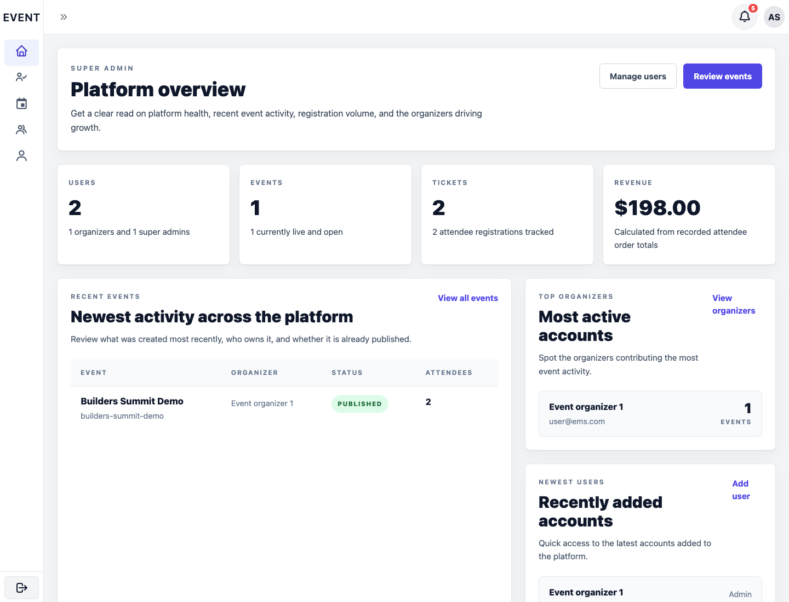

### Admin users

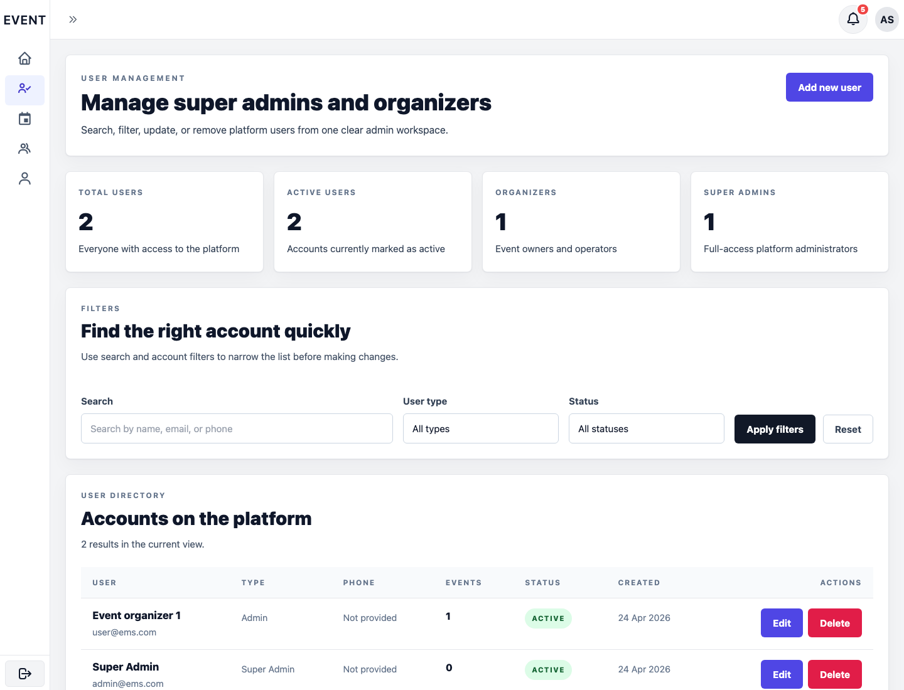

### Admin events

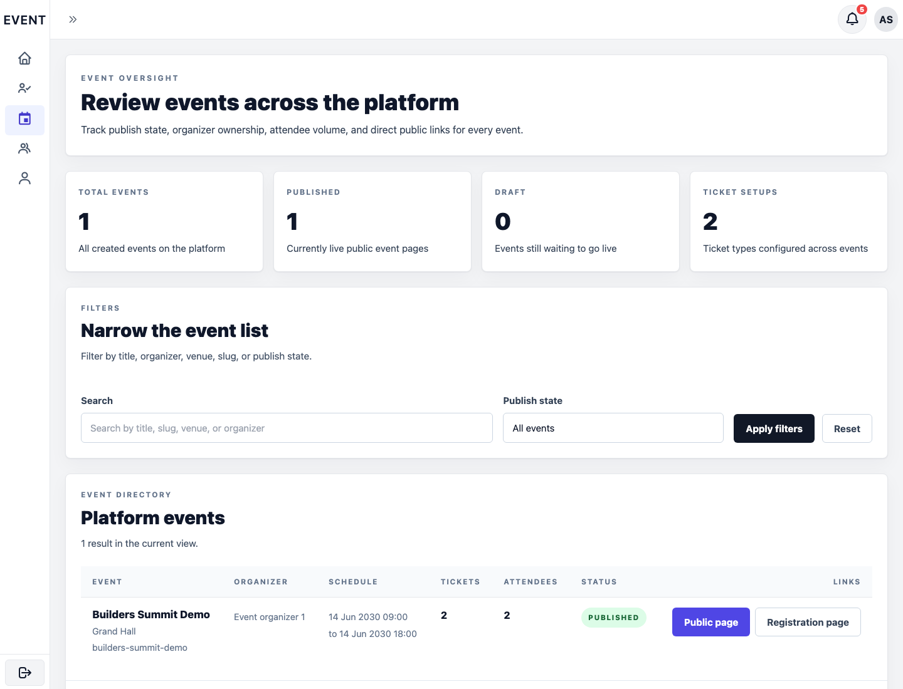

### Admin attendees

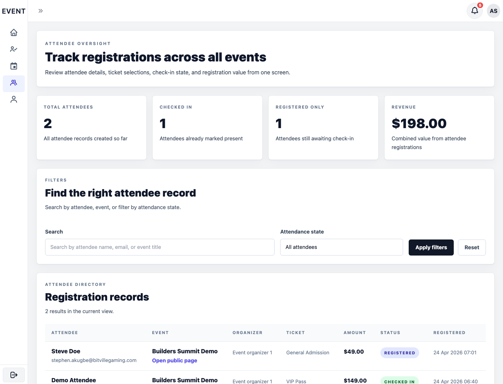

### Admin notifications

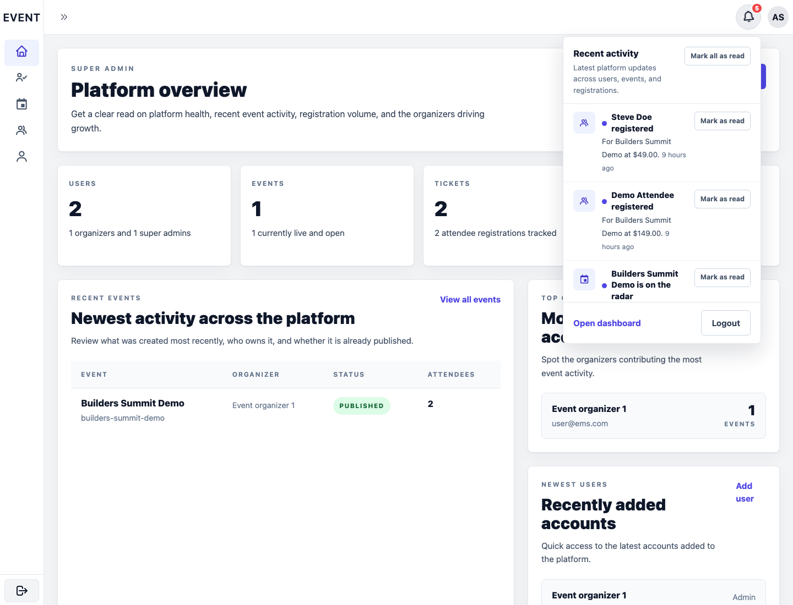

## Admin experience

The super admin area now includes:

- `/admin` for platform overview metrics and recent activity panels
- `/admin/users` for account management
- `/admin/events` for event oversight
- `/admin/attendees` for attendee and revenue oversight

The admin shell now includes a real recent-activity notification dropdown, unread counts, per-item mark-as-read actions, mark-all support, and automatic read-state updates when a notification is opened.

## Useful routes

- `/` for the public landing page
- `/login` for organizer and admin login
- `/admin` for the super admin overview
- `/admin/users` for user administration
- `/admin/events` for event administration
- `/admin/attendees` for attendee administration
- `/dashboard` for the organizer dashboard
- `/events` for the organizer event workspace
- `/e/{slug}` for the public event page
- `/e/{slug}/register` for attendee registration

## Suggested next improvements

- upgrade the framework to Laravel 10 or later
- add a payment provider for paid ticket checkout
- add attendee check-in actions from the dashboard
- add richer browser-level coverage for the refreshed admin UI
